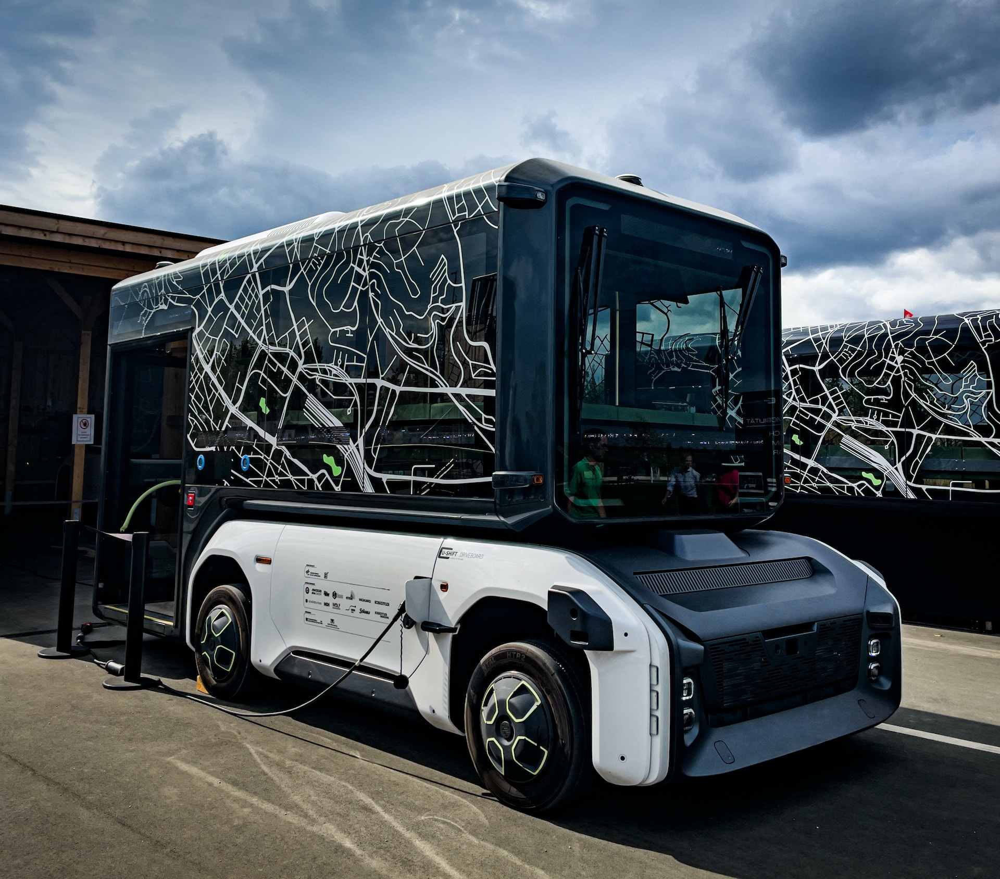

# Association between newly registered Passenger cars[^r1] and $CO2$ emissions in the EU

## Badges

[](https://choosealicense.com/licenses/mit/)
[](https://github.com/rafoolin/made-template/actions/workflows/pipeline.yml)
[](https://www.python.org/downloads/release/python-3110/)

## Introduction



Greenhouse gas emissions from transport account for 25% of the total EU greenhouse gas emissions. In order to achieve climate neutrality by 2050, as specified in the European Green Deal, there is a target to reduce greenhouse gas emissions from the transport sector by 90%. [^r2]

In this project, the primary objective is to explore the correlation between automobile choices and $CO_2$ emissions. This project aims to examine the impact of selecting one type of car engine  over another on $CO_2$ emissions and its consequent effects on various aspects of life. The objective is to comprehend how individuals' choices of car engine fuel contribute to the quantity of $CO_2$ emissions.

## Data sources

### Main data sources

#### Datasource1:  Europa(Average $CO_2$ emissions per km from new passenger cars)

* Metadata URL: <https://ec.europa.eu/eurostat/cache/metadata/en/sdg_12_30_esmsip2.htm>
* Data URL: <https://ec.europa.eu/eurostat/api/dissemination/sdmx/2.1/data/sdg_12_30/?format=SDMX-CSV&compressed=true>
* Data Type: CSV

The indicator is defined as the average carbon dioxide ($CO_2$) emissions per km by new passenger cars in a given year. The reported emissions are based on type-approval and can deviate from the actual $CO_2$ emissions of new cars. Since 2021, the emissions are measured with a new test procedure (Worldwide harmonized Light vehicles Test Procedure WLTP), compared to the New European Driving Cycle (NEDC) procedure used until 2020. The WLTP aims to reflect better real driving conditions and WLTP values are systematically higher than NEDC values. This change leads to a break in time series between 2020 and 2021.

#### Datasource2:  Europa(New passenger cars by type of motor energy)

* Metadata URL: <https://ec.europa.eu/eurostat/cache/metadata/en/rail_if_esms.htm>
* Data URL: <https://ec.europa.eu/eurostat/api/dissemination/sdmx/2.1/data/road_eqr_carpda/?format=SDMX-CSV&compressed=true>
* Data Type: CSV

The data in this dataset comes from the Common Questionnaire for Transport Statistics, developed and surveyed by Eurostat in cooperation between the United Nations Economic Commission for Europe (UNECE) and the International Transport Forum (ITF) at OECD.

### Side data sources

There are side data sources essential for understanding the information in the primary data sources. These sources typically provide mappings of abbreviations to their corresponding meanings in the main data sources.

#### Datasource1: Europa(GEO)
* GEO Code list URL: <https://ec.europa.eu/eurostat/api/dissemination/sdmx/2.1/codelist/ESTAT/GEO/?compressed=true&format=TSV&lang=en>
* Data Type: TSV

#### Datasource2: Europa(UNIT)

* Unit Abbr URL: <https://ec.europa.eu/eurostat/api/dissemination/sdmx/2.1/codelist/ESTAT/UNIT/?compressed=true&format=TSV&lang=en>
* Data Type: TSV

#### Datasource3: Europa(Motor Energy)

* Motor energy Abbr URL: <https://ec.europa.eu/eurostat/api/dissemination/sdmx/2.1/codelist/ESTAT/MOT_NRG/?compressed=true&format=TSV&lang=en>
* Data Type: TSV

## Documentation

There is a [Wiki](https://github.com/rafoolin/made-template/wiki) for some exercises and project's works.

## Jupyter notebook report

A Jupyter notebook report named [report.ipynb](https://github.com/rafoolin/made-template/blob/main/project/report.ipynb) is available in the `project` directory. This report systematically details the data sources employed and outlines the Extract, Transform, Load (ETL) processes utilized to investigate the primary question. The objective is to identify any potential correlations between the carbon dioxide ($CO_2$) emissions and the motor engine types of recently registered cars in Europe(Mainly EU).

There is also a pipeline in the `project` directory. This pipeline downloads data sources, performs cleaning and transformation tasks, and subsequently generates a new SQL dataset tailored to the specific requirements of the project. To run the pipeline locally and generate the SQL file, follow the next step.

## Run Pipeline Locally

Clone the project

```bash
  git clone git@github.com:rafoolin/made-template.git
```

Go to the project directory

```bash
  cd made-template
```

Run the bash script `project/pipeline.sh`

```bash
  bash project/pipeline.sh
```

This will start a virtual environment and finally create a SQL database out of data sources named `pipeline` in `\data` directory.

## Running Tests

To run tests, run the following command

```bash
  bash project/tests.sh
```

## Future work

It is recommended to explore data sources that provide in-depth details about cars, like open data from factories sharing their greenhouse gas (GHG) emissions during production. The impact on the environment goes beyond just using the car, and it's crucial to look at the whole life cycle. For example, if making electric cars produces a lot of GHG emissions, that's an important factor to think of. So, including data from the manufacturing phase is really important to get a complete picture of how different types of motors affect the environment.
A comparative analysis allows for understanding tradeoffs between different motor types. If one type of vehicle has higher manufacturing emissions but significantly lower operational emissions, it's important to weigh these factors when considering the overall environmental impact.

To gain a comprehensive understanding of how one type of motor energy impacts greenhouse gas (GHG) emissions compared to another, it is advisable to incorporate additional data sources. For instance, analyzing data on the age of newly registered cars could provide valuable insights into how emissions evolve over time.
Understanding how GHG emissions change as vehicles age can inform policy decisions. For example, it can help policymakers assess the effectiveness of emissions standards and regulations over the lifespan of a vehicle.

In Germany, there is available open data on the car market, providing access to information about new cars in the market that potential buyers may consider. Utilizing the data from these sources, models can be developed to train for $CO_2$ emissions. Users can then choose specific parameters for their preferred car, enabling them to compare and make informed decisions based on $CO_2$ emissions. This approach allows users to comprehend the environmental impact, illustrating how each selected car contributes a specific amount of $CO_2$ emissions per kilometer, empowering them to make environmentally conscious decisions.

## Limitations

Since 2021, the emissions are measured with a new test procedure (Worldwide harmonized Light vehicles Test Procedure WLTP), compared to the New European Driving Cycle (NEDC) procedure used until 2020. The WLTP aims to reflect better real driving conditions and WLTP values are systematically higher than NEDC values. This change leads to a break in time series between 2020 and 2021. $^5$

The $CO_2$ emission data lacks information for the year 2023, and significant fluctuations occurred from 2019 to 2021, primarily attributed to the COVID-19 situation.

There are some missing data for years prior to 2017 for some motor types.

## Contributing

Contributions are always welcome!
To explore potential areas for future work related to this project, please refer to the [future-work](#future-work) section.

## Feedback

If you have any feedback, please reach out to me at niloo.jv@gmail.com

## Licenses

Photo by <a href="https://unsplash.com/@hdbernd?utm_content=creditCopyText&utm_medium=referral&utm_source=unsplash">Bernd 📷 Dittrich</a> on <a href="https://unsplash.com/photos/a-large-truck-parked-on-the-side-of-a-road-jKTTnPf7GMg?utm_content=creditCopyText&utm_medium=referral&utm_source=unsplash">Unsplash</a>
  
[^r1]: A passenger car is a road motor vehicle, other than a moped or a motor cycle, intended for the carriage of passengers and designed to seat no more than nine persons (including the driver). The term passenger car also covers microcars (small cars which, depending on individual Member State legislation, may need no permit to be driven and/ or benefit from lower vehicle taxation), taxis and other hired passenger cars, provided that they have fewer than 10 seats in total. This category may also includes vans designed and used primarily for transport of passengers, as well as ambulances and motor homes. Excluded are light goods road vehicles, as well as motor coaches and buses and mini-buses/mini-coaches. [more...](https://ec.europa.eu/eurostat/statistics-explained/index.php?title=Glossary:Passenger_car)

[^r2]: EC, 2021, Communication from the Commission to the European Parliament, the Council, the European Economic and Social Committee and the Committee of the Regions ‘Fit for 55’: delivering the EU’s 2030 Climate Target on the way to climate neutrality, COM(2021) 550 final
